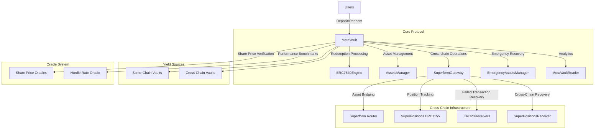
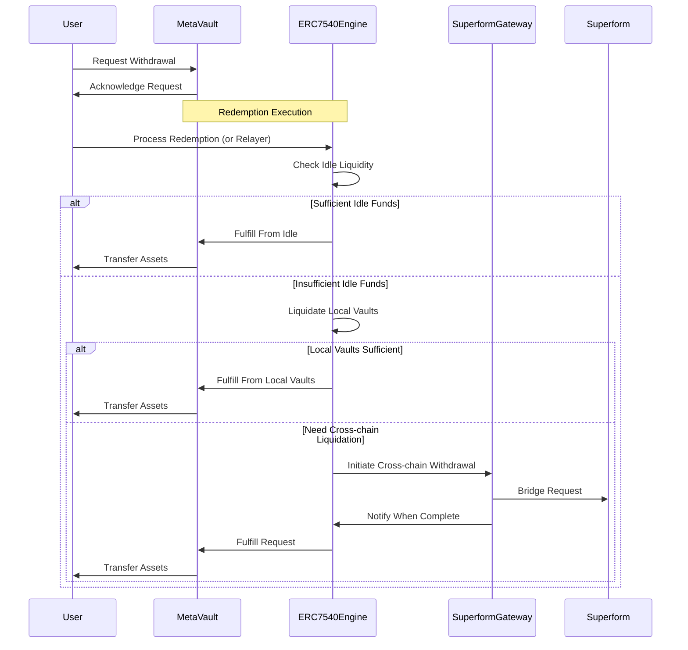

# maxAPY MetaVault Protocol

> Professional cross-chain yield aggregation protocol built on ERC7540

[](https://soliditylang.org/)
[](https://github.com/Zoltu/soldeer)

## Overview

MetaVault is a next-generation yield aggregation protocol that enables efficient cross-chain capital allocation through asynchronous deposits and withdrawals. Built on the ERC7540 standard, it provides a secure and modular architecture for managing assets across multiple blockchain networks.

The protocol leverages Superform infrastructure to deposit and withdraw from vaults on other chains, allowing users to access yield opportunities across the DeFi ecosystem from a single interface without having to manage multiple wallets or bridge assets manually.

## Key Features

### Cross-Chain Interoperability
- **Seamless Multi-Chain Operations**: Invest and divest across Ethereum, Polygon, Optimism, Base, Arbitrum, and more from a single interface
- **Asynchronous Processing**: Built on ERC7540 for non-blocking deposit and withdrawal operations
- **Bridging Agnostic**: Leverages Superform protocol for reliable cross-chain messaging and asset transfers

### Advanced Portfolio Management
- **Sophisticated Withdrawal Strategy**: Three-tier liquidation system that optimizes gas and minimizes slippage
- **Prioritized Liquidation Queue**: Configurable withdrawal queues for both local and cross-chain vaults
- **Risk Management**: Circuit breakers and emergency recovery mechanisms to protect user funds

### Professional Fee Structure
- **Performance Fee with High Watermark**: Only charge performance fees on new profits
- **Hurdle Rate Implementation**: Performance fees only apply above minimum return thresholds
- **Time-Weighted Management Fees**: Fairly calculated based on duration of asset custody
- **Customizable Fee Exemptions**: Special rates for strategic partners or institutional clients

### Security & Resilience
- **Modular Proxy Architecture**: Upgradeable components for continuous improvement
- **Cross-Chain Recovery System**: Dedicated recovery contracts for handling failed bridge transactions
- **Emergency Shutdown**: Circuit breakers to pause operations during extreme market conditions

## Architecture

MetaVault employs a modular architecture with specialized components. Both the MetaVault and SuperformGateway contracts use a simplified version of the diamond proxy pattern called MultiFacet proxy, which allows for modular functionality and upgradeability.



## Protocol Flow

### Deposit Flow

1. User deposits assets into MetaVault
2. User receives vault shares that represent their proportional ownership
3. Protocol manager allocates capital to various yield sources
4. Capital can be deployed across same-chain or cross-chain vaults based on yield opportunities

### Withdrawal Flow



## Technical Implementation

### Core Smart Contracts

The protocol is built around four main contract systems:

1. **MetaVault and its modules**
   - `MetaVault.sol`: Main vault contract implementing ERC7540 for asynchronous operations
   - `ERC7540Engine.sol`: Processes redemption requests and manages withdrawal strategies
   - `AssetsManager.sol`: Manages asset allocation and interaction with underlying vaults
   - `EmergencyAssetsManager.sol`: Provides emergency recovery functions
   - `MetaVaultReader.sol`: Offers analytics and reporting functions

2. **SuperformGateway and its modules**
   - `SuperformGateway.sol`: Handles cross-chain communication and asset transfers
   - `InvestSuperform.sol`: Manages cross-chain deposit operations
   - `DivestSuperform.sol`: Manages cross-chain withdrawal operations
   - `LiquidateSuperform.sol`: Manages cross-chain redemption operations

3. **Recovery Contracts**
   - `ERC20Receiver.sol`: Receives and manages assets during cross-chain operations
   - `SuperPositionsReceiver.sol`: Recovers stuck assets from failed cross-chain operations

4. **External Protocol Integration**
   - Uses Superform Router for cross-chain message passing
   - Uses SuperPositions (ERC1155) for tracking cross-chain positions
   - Custom Share Price Oracle system to track and verify the price of shares (SuperPositions) owned by MetaVault across different chains

### Fee Structure

#### Management Fee
- Annual rate applied to total assets under management
- Pro-rated based on time assets are held in vault
- Configurable rate with admin controls

#### Performance Fee
- Applied only to profits above the high watermark
- Subject to hurdle rate (minimum performance threshold)
- Only charged on excess returns above the hurdle rate

#### Oracle Fee
- Covers cost of cross-chain price oracle operations
- Network-specific rates to account for varying gas costs
- Proportional to duration of asset custody

## Getting Started

### Prerequisites

To install Foundry:

```bash
curl -L https://foundry.paradigm.xyz | bash
foundryup
```

To install Soldeer:

```bash
cargo install soldeer
```

### Clone and Install

```bash
git clone https://github.com/UnlockdFinance/metavault.git
cd metavault
soldeer install
```

### Compile

```bash
forge build
```

### Test

```bash
# Set test environment
export FOUNDRY_PROFILE=fork

# Run all tests
forge test

# Run specific test file
forge test --match-path test/MetaVault.t.sol

# Run with gas reporting
forge test --gas-report
```

## Deployment

MetaVault can be deployed to various networks using the deployment scripts in the `script` directory:

```bash
# Deploy to Base network
forge script script/base/01_Deploy.s.sol --rpc-url $RPC_BASE --broadcast --verify
```

Environment variables needed for deployment:
- `DEPLOYER_PRIVATE_KEY`: Private key of the deployer account
- `ADMIN_AND_OWNER_ROLE`: Address to receive admin and owner roles
- `RELAYER_ROLE`: Address to receive relayer role
- `EMERGENCY_ADMIN_ROLE`: Address to receive emergency admin role
- `MANAGER_ADDRESS_ROLE`: Address to receive manager role
- `HURDLE_RATE_ORACLE_ADDRESS`: Address of the hurdle rate oracle

## License

This project is licensed under dual licenses:
- Core contracts: UNLICENSED (Proprietary) - See [LICENSE](licenses/LICENSE)
  - Applies to core protocol functionality
- Helper libraries and interfaces: MIT License - See [MIT_LICENSE](licenses/MIT_LICENSE)